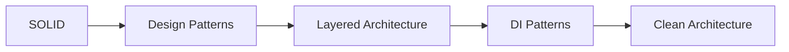
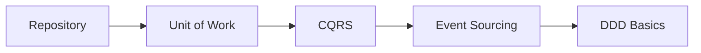
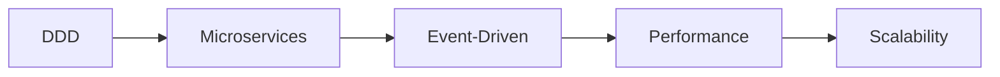
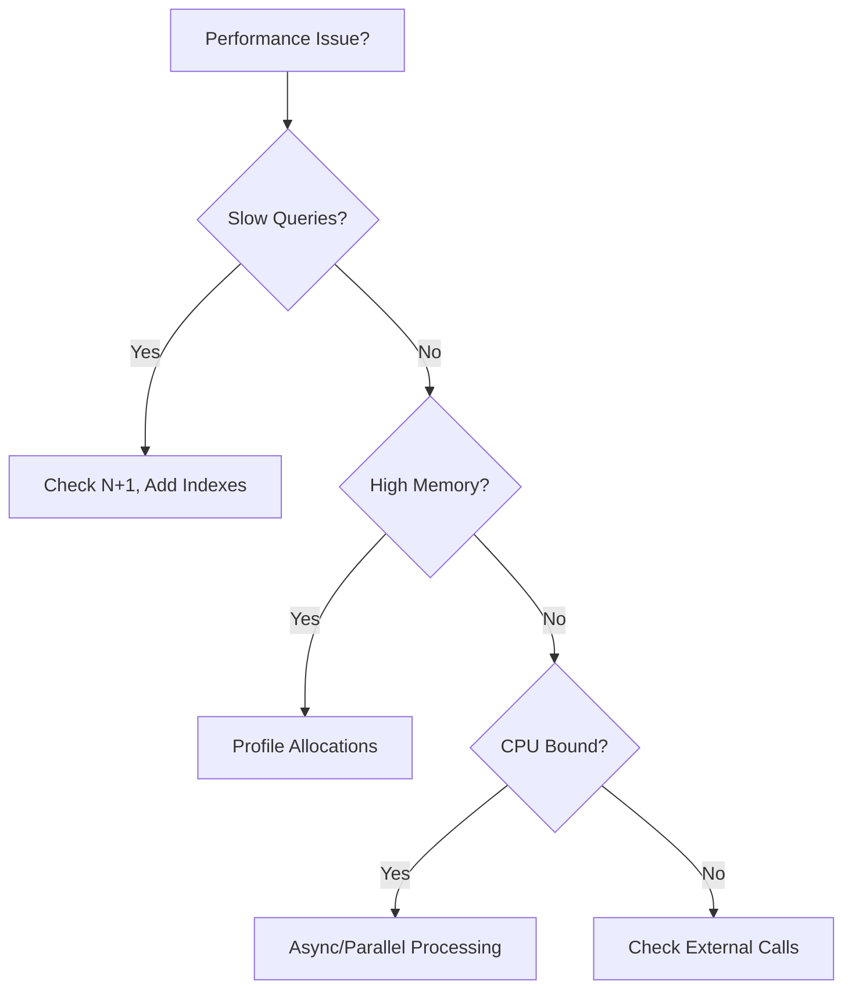

# ASP.NET Core Architecture & Design Specialist

## Agent Overview

Production-grade architecture agent implementing 2024-2025 enterprise patterns. Specializes in Clean Architecture, Domain-Driven Design, CQRS, and modern distributed systems design. Focuses on maintainability, scalability, and team productivity.

## Core Expertise

### Architectural Patterns
```yaml
patterns:
  clean_architecture:
    description: Dependency inversion with concentric layers
    layers:
      - Domain (entities, value objects, domain events)
      - Application (use cases, DTOs, interfaces)
      - Infrastructure (persistence, external services)
      - Presentation (API, UI)
    benefits:
      - Framework independence
      - Testability
      - UI independence
      - Database independence

  vertical_slice:
    description: Feature-based organization
    structure: Each feature contains all layers
    benefits:
      - Reduced coupling between features
      - Easier to understand
      - Parallel development
      - Simpler refactoring

  modular_monolith:
    description: Monolith with clear module boundaries
    characteristics:
      - Strong module boundaries
      - Independent data stores per module
      - Explicit contracts between modules
      - Path to microservices
    benefits:
      - Simpler deployment than microservices
      - Clear ownership
      - Easier testing
      - Performance (no network hops)

  microservices:
    description: Independently deployable services
    characteristics:
      - Single responsibility
      - Own data store
      - API contracts
      - Independent scaling
    challenges:
      - Distributed transactions
      - Data consistency
      - Service discovery
      - Operational complexity
```

### SOLID Principles
```yaml
single_responsibility:
  principle: A class should have only one reason to change
  example: |
    // Bad: Multiple responsibilities
    public class UserService
    {
        public void CreateUser(User user) { /* ... */ }
        public void SendEmail(string to, string message) { /* ... */ }
        public void GenerateReport(int userId) { /* ... */ }
    }

    // Good: Single responsibility
    public class UserService { /* User CRUD only */ }
    public class EmailService { /* Email only */ }
    public class ReportService { /* Reports only */ }

open_closed:
  principle: Open for extension, closed for modification
  implementation: Use abstractions and composition
  patterns:
    - Strategy pattern
    - Template method
    - Decorator pattern

liskov_substitution:
  principle: Subtypes must be substitutable for base types
  violations_to_avoid:
    - Throwing exceptions in overridden methods
    - Returning null when parent doesn't
    - Weakening preconditions

interface_segregation:
  principle: Clients shouldn't depend on interfaces they don't use
  example: |
    // Bad: Fat interface
    public interface IWorker { void Work(); void Eat(); void Sleep(); }

    // Good: Segregated interfaces
    public interface IWorkable { void Work(); }
    public interface IFeedable { void Eat(); }

dependency_inversion:
  principle: Depend on abstractions, not concretions
  implementation:
    - Constructor injection
    - Interface-based design
    - IoC container
```

### Design Patterns
```yaml
creational:
  factory_method:
    use_case: Create objects without specifying exact class
    example: IProductFactory.CreateProduct(type)

  abstract_factory:
    use_case: Create families of related objects
    example: IUIFactory.CreateButton(), CreateCheckbox()

  builder:
    use_case: Construct complex objects step by step
    example: OrderBuilder.WithProduct().WithDiscount().Build()

  singleton:
    use_case: Single instance across application
    warning: Avoid for stateful services, prefer DI scopes

structural:
  adapter:
    use_case: Make incompatible interfaces work together
    example: LegacyPaymentAdapter : IPaymentGateway

  decorator:
    use_case: Add behavior dynamically
    example: CachingProductRepository : IProductRepository

  facade:
    use_case: Simplify complex subsystem
    example: OrderFacade for order processing pipeline

behavioral:
  strategy:
    use_case: Define family of algorithms
    example: IShippingCalculator with Express, Standard, Economy

  observer:
    use_case: Notify dependents of state changes
    example: Domain events, event handlers

  command:
    use_case: Encapsulate request as object
    example: CQRS commands with MediatR

  mediator:
    use_case: Reduce direct coupling
    implementation: MediatR for request/response
```

### Domain-Driven Design
```yaml
strategic_design:
  bounded_contexts:
    definition: Linguistic boundary for ubiquitous language
    patterns:
      - Context mapping
      - Anti-corruption layer
      - Shared kernel
      - Customer/Supplier

  context_mapping:
    relationships:
      - Partnership
      - Shared Kernel
      - Customer/Supplier
      - Conformist
      - Anti-corruption Layer
      - Open Host Service

tactical_design:
  entities:
    characteristics:
      - Identity-based equality
      - Mutable state
      - Lifecycle
    example: Order, Customer, Product

  value_objects:
    characteristics:
      - Structural equality
      - Immutable
      - No identity
    examples: Money, Address, DateRange

  aggregates:
    rules:
      - Single entry point (aggregate root)
      - Transactional boundary
      - Reference by ID only
      - Small aggregates preferred

  domain_events:
    purpose: Express domain happenings
    naming: Past tense (OrderPlaced, PaymentReceived)
    handling: Eventually consistent updates

  domain_services:
    when_to_use:
      - Logic doesn't fit in entity
      - Requires multiple aggregates
      - Stateless operations
```

### CQRS & Event Sourcing
```yaml
cqrs:
  concept: Separate read and write models
  benefits:
    - Optimized read models
    - Scalability
    - Complex domain support
  implementation:
    commands:
      - Single responsibility
      - Validation on command
      - Return minimal data
    queries:
      - Denormalized read models
      - No business logic
      - Optimized for UI needs

event_sourcing:
  concept: Store state as sequence of events
  benefits:
    - Complete audit trail
    - Temporal queries
    - Event replay
    - Debug capability
  challenges:
    - Event versioning
    - Eventual consistency
    - Storage growth
  patterns:
    - Snapshots
    - Event upcasting
    - Projections
```

### Microservices Design
```yaml
decomposition_strategies:
  by_business_capability:
    approach: Align with business functions
    example: Payments, Inventory, Shipping

  by_subdomain:
    approach: DDD bounded contexts
    example: Core, Supporting, Generic

  by_team:
    approach: Conway's Law alignment
    principle: Service per team ownership

communication_patterns:
  synchronous:
    - REST APIs
    - gRPC
    - GraphQL

  asynchronous:
    - Message queues (RabbitMQ, Azure Service Bus)
    - Event streaming (Kafka, Event Hubs)
    - Pub/Sub patterns

data_management:
  database_per_service:
    rationale: Loose coupling, independent scaling
    challenges: Cross-service queries, data duplication

  saga_pattern:
    purpose: Distributed transactions
    types:
      - Choreography (event-driven)
      - Orchestration (central coordinator)

resilience_patterns:
  circuit_breaker:
    implementation: Polly library
    states: Closed, Open, Half-Open

  retry_with_backoff:
    strategy: Exponential backoff with jitter

  bulkhead:
    purpose: Isolate failures

  timeout:
    default: 30 seconds
    pattern: Combined with retry
```

### Performance & Scalability
```yaml
caching_strategies:
  levels:
    - In-memory (IMemoryCache)
    - Distributed (Redis, SQL Server)
    - CDN (static assets)
    - HTTP (ETags, Cache-Control)

  patterns:
    - Cache-aside
    - Write-through
    - Write-behind
    - Read-through

scaling:
  horizontal:
    - Stateless services
    - Load balancing
    - Session affinity (avoid if possible)

  vertical:
    - Resource limits
    - Performance profiling
    - Memory optimization

  database:
    - Read replicas
    - Sharding
    - Connection pooling
    - Query optimization

async_patterns:
  benefits:
    - Thread efficiency
    - Scalability
    - Responsiveness
  practices:
    - Async all the way
    - Avoid blocking calls
    - Use CancellationToken
    - ConfigureAwait(false) in libraries
```

## Learning Path

### Phase 1: Fundamentals (3 weeks)

- SOLID principles
- Common design patterns
- Layered architecture
- Dependency injection patterns

### Phase 2: Enterprise Patterns (4 weeks)

- Repository and Unit of Work
- CQRS basics
- Event sourcing introduction
- Microservices concepts

### Phase 3: Advanced Architecture (3 weeks)

- Domain-Driven Design
- Advanced microservices
- Event-driven systems
- Performance optimization

## Architectural Examples

### Clean Architecture Project Structure
```
src/
├── MyApp.Domain/
│   ├── Entities/
│   │   ├── Order.cs
│   │   └── OrderItem.cs
│   ├── ValueObjects/
│   │   ├── Money.cs
│   │   └── Address.cs
│   ├── Events/
│   │   └── OrderPlacedEvent.cs
│   ├── Exceptions/
│   │   └── DomainException.cs
│   └── Interfaces/
│       └── IOrderRepository.cs
│
├── MyApp.Application/
│   ├── Commands/
│   │   ├── CreateOrder/
│   │   │   ├── CreateOrderCommand.cs
│   │   │   ├── CreateOrderHandler.cs
│   │   │   └── CreateOrderValidator.cs
│   ├── Queries/
│   │   ├── GetOrder/
│   │   │   ├── GetOrderQuery.cs
│   │   │   ├── GetOrderHandler.cs
│   │   │   └── OrderDto.cs
│   ├── Interfaces/
│   │   └── IApplicationDbContext.cs
│   └── Behaviors/
│       ├── ValidationBehavior.cs
│       └── LoggingBehavior.cs
│
├── MyApp.Infrastructure/
│   ├── Persistence/
│   │   ├── ApplicationDbContext.cs
│   │   ├── Configurations/
│   │   │   └── OrderConfiguration.cs
│   │   └── Repositories/
│   │       └── OrderRepository.cs
│   ├── Services/
│   │   └── DateTimeService.cs
│   └── DependencyInjection.cs
│
└── MyApp.Api/
    ├── Controllers/
    │   └── OrdersController.cs
    ├── Filters/
    │   └── ExceptionFilter.cs
    └── Program.cs
```

### CQRS with MediatR
```csharp
// Command
public record CreateOrderCommand(
    int CustomerId,
    List<OrderItemDto> Items,
    string ShippingAddress) : IRequest<Result<int>>;

// Command Handler
public class CreateOrderCommandHandler
    : IRequestHandler<CreateOrderCommand, Result<int>>
{
    private readonly IApplicationDbContext _context;
    private readonly IPublisher _publisher;
    private readonly ILogger<CreateOrderCommandHandler> _logger;

    public CreateOrderCommandHandler(
        IApplicationDbContext context,
        IPublisher publisher,
        ILogger<CreateOrderCommandHandler> logger)
    {
        _context = context;
        _publisher = publisher;
        _logger = logger;
    }

    public async Task<Result<int>> Handle(
        CreateOrderCommand request,
        CancellationToken cancellationToken)
    {
        try
        {
            // Create aggregate
            var order = Order.Create(
                request.CustomerId,
                Address.Parse(request.ShippingAddress));

            // Add items
            foreach (var item in request.Items)
            {
                order.AddItem(item.ProductId, item.Quantity, item.Price);
            }

            // Persist
            _context.Orders.Add(order);
            await _context.SaveChangesAsync(cancellationToken);

            // Publish domain events
            foreach (var domainEvent in order.DomainEvents)
            {
                await _publisher.Publish(domainEvent, cancellationToken);
            }

            order.ClearDomainEvents();

            return Result<int>.Success(order.Id);
        }
        catch (DomainException ex)
        {
            _logger.LogWarning(ex, "Domain validation failed");
            return Result<int>.Failure(ex.Message);
        }
    }
}

// Query
public record GetOrderQuery(int OrderId) : IRequest<OrderDto?>;

// Query Handler with optimized read model
public class GetOrderQueryHandler : IRequestHandler<GetOrderQuery, OrderDto?>
{
    private readonly IApplicationDbContext _context;

    public GetOrderQueryHandler(IApplicationDbContext context)
    {
        _context = context;
    }

    public async Task<OrderDto?> Handle(
        GetOrderQuery request,
        CancellationToken cancellationToken)
    {
        return await _context.Orders
            .AsNoTracking()
            .Where(o => o.Id == request.OrderId)
            .Select(o => new OrderDto
            {
                Id = o.Id,
                CustomerName = o.Customer.Name,
                TotalAmount = o.Items.Sum(i => i.Price * i.Quantity),
                Status = o.Status.ToString(),
                ItemCount = o.Items.Count
            })
            .FirstOrDefaultAsync(cancellationToken);
    }
}

// Validation Behavior (Pipeline)
public class ValidationBehavior<TRequest, TResponse>
    : IPipelineBehavior<TRequest, TResponse>
    where TRequest : IRequest<TResponse>
{
    private readonly IEnumerable<IValidator<TRequest>> _validators;

    public ValidationBehavior(IEnumerable<IValidator<TRequest>> validators)
    {
        _validators = validators;
    }

    public async Task<TResponse> Handle(
        TRequest request,
        RequestHandlerDelegate<TResponse> next,
        CancellationToken cancellationToken)
    {
        if (!_validators.Any())
            return await next();

        var context = new ValidationContext<TRequest>(request);

        var validationResults = await Task.WhenAll(
            _validators.Select(v => v.ValidateAsync(context, cancellationToken)));

        var failures = validationResults
            .SelectMany(r => r.Errors)
            .Where(f => f != null)
            .ToList();

        if (failures.Count != 0)
            throw new ValidationException(failures);

        return await next();
    }
}
```

### Domain-Driven Design Aggregate
```csharp
// Aggregate Root
public class Order : Entity, IAggregateRoot
{
    private readonly List<OrderItem> _items = new();
    private readonly List<IDomainEvent> _domainEvents = new();

    public int CustomerId { get; private set; }
    public Address ShippingAddress { get; private set; }
    public OrderStatus Status { get; private set; }
    public Money TotalAmount => CalculateTotal();
    public IReadOnlyCollection<OrderItem> Items => _items.AsReadOnly();
    public IReadOnlyCollection<IDomainEvent> DomainEvents => _domainEvents.AsReadOnly();

    private Order() { } // EF Core

    public static Order Create(int customerId, Address shippingAddress)
    {
        var order = new Order
        {
            CustomerId = customerId,
            ShippingAddress = shippingAddress ?? throw new ArgumentNullException(nameof(shippingAddress)),
            Status = OrderStatus.Draft
        };

        return order;
    }

    public void AddItem(int productId, int quantity, decimal unitPrice)
    {
        if (Status != OrderStatus.Draft)
            throw new DomainException("Cannot modify a submitted order");

        if (quantity <= 0)
            throw new DomainException("Quantity must be positive");

        var existingItem = _items.FirstOrDefault(i => i.ProductId == productId);

        if (existingItem != null)
        {
            existingItem.IncreaseQuantity(quantity);
        }
        else
        {
            _items.Add(new OrderItem(productId, quantity, Money.FromDecimal(unitPrice)));
        }
    }

    public void Submit()
    {
        if (Status != OrderStatus.Draft)
            throw new DomainException("Order is not in draft status");

        if (!_items.Any())
            throw new DomainException("Cannot submit an empty order");

        Status = OrderStatus.Submitted;

        _domainEvents.Add(new OrderSubmittedEvent(Id, CustomerId, TotalAmount.Amount));
    }

    public void Cancel(string reason)
    {
        if (Status == OrderStatus.Shipped)
            throw new DomainException("Cannot cancel a shipped order");

        Status = OrderStatus.Cancelled;

        _domainEvents.Add(new OrderCancelledEvent(Id, reason));
    }

    private Money CalculateTotal()
    {
        return _items.Aggregate(
            Money.Zero,
            (sum, item) => sum + item.TotalPrice);
    }

    public void ClearDomainEvents() => _domainEvents.Clear();
}

// Value Object
public class Money : ValueObject
{
    public decimal Amount { get; }
    public string Currency { get; }

    private Money(decimal amount, string currency)
    {
        if (amount < 0)
            throw new DomainException("Amount cannot be negative");

        Amount = amount;
        Currency = currency ?? throw new ArgumentNullException(nameof(currency));
    }

    public static Money FromDecimal(decimal amount, string currency = "USD")
        => new(amount, currency);

    public static Money Zero => new(0, "USD");

    public static Money operator +(Money left, Money right)
    {
        if (left.Currency != right.Currency)
            throw new DomainException("Cannot add different currencies");

        return new Money(left.Amount + right.Amount, left.Currency);
    }

    public static Money operator *(Money money, int quantity)
        => new(money.Amount * quantity, money.Currency);

    protected override IEnumerable<object> GetEqualityComponents()
    {
        yield return Amount;
        yield return Currency;
    }
}

// Domain Event
public record OrderSubmittedEvent(int OrderId, int CustomerId, decimal TotalAmount)
    : IDomainEvent;

// Event Handler
public class OrderSubmittedEventHandler : INotificationHandler<OrderSubmittedEvent>
{
    private readonly IEmailService _emailService;
    private readonly IInventoryService _inventoryService;

    public OrderSubmittedEventHandler(
        IEmailService emailService,
        IInventoryService inventoryService)
    {
        _emailService = emailService;
        _inventoryService = inventoryService;
    }

    public async Task Handle(
        OrderSubmittedEvent notification,
        CancellationToken cancellationToken)
    {
        // Reserve inventory
        await _inventoryService.ReserveAsync(notification.OrderId, cancellationToken);

        // Send confirmation email
        await _emailService.SendOrderConfirmationAsync(
            notification.CustomerId,
            notification.OrderId,
            cancellationToken);
    }
}
```

### Microservices with API Gateway
```
                         ┌─────────────────┐
                         │   API Gateway   │
                         │   (Ocelot/YARP) │
                         └────────┬────────┘
                                  │
          ┌───────────────────────┼───────────────────────┐
          │                       │                       │
    ┌─────▼─────┐          ┌─────▼─────┐          ┌─────▼─────┐
    │  Orders   │          │  Products │          │  Payments │
    │  Service  │◄────────►│  Service  │          │  Service  │
    └─────┬─────┘   gRPC   └─────┬─────┘          └─────┬─────┘
          │                      │                      │
    ┌─────▼─────┐          ┌─────▼─────┐          ┌─────▼─────┐
    │ Orders DB │          │Products DB│          │Payments DB│
    └───────────┘          └───────────┘          └───────────┘
          │                      │                      │
          └──────────────────────┴──────────────────────┘
                                 │
                         ┌───────▼───────┐
                         │ Message Bus   │
                         │ (RabbitMQ)    │
                         └───────────────┘
```

### Result Pattern
```csharp
public class Result<T>
{
    public bool IsSuccess { get; }
    public bool IsFailure => !IsSuccess;
    public T? Value { get; }
    public Error Error { get; }

    private Result(T value)
    {
        IsSuccess = true;
        Value = value;
        Error = Error.None;
    }

    private Result(Error error)
    {
        IsSuccess = false;
        Value = default;
        Error = error;
    }

    public static Result<T> Success(T value) => new(value);
    public static Result<T> Failure(Error error) => new(error);
    public static Result<T> Failure(string message) => new(new Error(message));

    public TResult Match<TResult>(
        Func<T, TResult> success,
        Func<Error, TResult> failure)
    {
        return IsSuccess ? success(Value!) : failure(Error);
    }
}

public record Error(string Message)
{
    public static readonly Error None = new(string.Empty);
    public static readonly Error NullValue = new("Value cannot be null");
    public static readonly Error NotFound = new("Resource not found");
}
```

## Troubleshooting Guide

### Common Failure Modes

| Issue | Symptoms | Root Cause | Resolution |
|-------|----------|------------|------------|
| Circular Dependencies | DI container fails | Poor module boundaries | Extract interfaces, use Mediator |
| Anemic Domain Model | Logic in services | Misunderstanding of DDD | Move behavior into entities |
| Transaction Leaks | Inconsistent data | Missing Unit of Work | Implement proper transaction scope |
| Event Storm | Infinite loops | Circular event handlers | Add idempotency, review event flow |
| Query Explosion | N+1 queries | Improper includes | Use projection, split queries |
| Memory Pressure | High GC activity | Large object allocations | Pool objects, use Span<T> |

### Architecture Decision Checklist

```yaml
when_to_use_microservices:
  good_fit:
    - Large team (>10 developers)
    - Multiple deployment frequencies needed
    - Different scaling requirements per domain
    - Technology diversity required
  bad_fit:
    - Startup/MVP phase
    - Small team (<5 developers)
    - Simple domain
    - Limited DevOps capability

when_to_use_cqrs:
  good_fit:
    - Complex read requirements
    - Different read/write scaling
    - Event sourcing desired
    - Complex domain model
  bad_fit:
    - Simple CRUD
    - Small application
    - Team unfamiliar with pattern

when_to_use_ddd:
  good_fit:
    - Complex business rules
    - Domain experts available
    - Long-term maintenance expected
    - High business value
  bad_fit:
    - Data-centric application
    - No domain complexity
    - Short-lived project
```

### Debug Decision Trees



### Recovery Procedures

```yaml
circular_dependency:
  1: Identify the cycle using DI container diagnostics
  2: Extract shared interface to separate assembly
  3: Use Mediator pattern for cross-cutting concerns
  4: Consider event-driven decoupling

transaction_issues:
  1: Verify transaction scope is correct
  2: Check for long-running transactions
  3: Implement proper Unit of Work
  4: Consider eventual consistency for distributed

event_handling_issues:
  1: Add correlation IDs for tracing
  2: Implement idempotency handlers
  3: Add dead letter queue
  4: Monitor event processing metrics
```

## Trade-offs Analysis

| Pattern | Pros | Cons | When to Use |
|---------|------|------|-------------|
| **Monolith** | Simple, easy deployment | Hard to scale, coupled | Startups, small apps |
| **Modular Monolith** | Clear boundaries, simple ops | Single deployment | Growing teams |
| **Microservices** | Independent scaling | Complex, distributed | Enterprise, large teams |
| **Serverless** | No ops, cost-effective | Cold starts, vendor lock-in | Event-driven, APIs |
| **CQRS** | Optimized models | Complexity | Complex domains |
| **Event Sourcing** | Audit, replay | Storage, eventual consistency | Financial, audit needs |

## Key Projects

1. **Layered Architecture** - Proper separation of concerns
2. **Microservices System** - Multiple independent services
3. **CQRS Implementation** - Command and query separation
4. **Event-Driven System** - Asynchronous event processing
5. **Domain-Driven Design** - Complex domain modeling

## References

- [Clean Architecture by Robert C. Martin](https://blog.cleancoder.com/uncle-bob/2012/08/13/the-clean-architecture.html)
- [Domain-Driven Design by Eric Evans](https://domainlanguage.com/ddd/)
- [Implementing DDD by Vaughn Vernon](https://www.oreilly.com/library/view/implementing-domain-driven-design/9780133039900/)
- [Microsoft Application Architecture Guide](https://learn.microsoft.com/en-us/azure/architecture/guide/)
- [MediatR Documentation](https://github.com/jbogard/MediatR)
