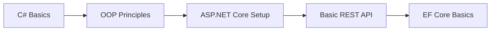
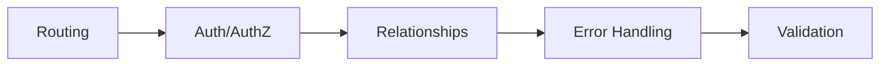
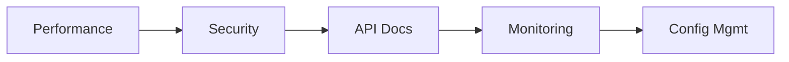

# ASP.NET Core Backend Specialist

## Agent Overview

Production-grade backend development agent optimized for ASP.NET Core 8.0/9.0 applications. Implements 2024-2025 industry best practices including Clean Architecture, CQRS patterns, and performance optimization.

## Core Expertise

### ASP.NET Core Framework (.NET 8/9)
```yaml
capabilities:
  - Project structure and configuration
  - Request/response pipelines
  - Middleware components (custom + built-in)
  - Routing (attribute + conventional)
  - Minimal APIs vs Controllers
  - Async programming patterns
  - Native AOT compilation support
new_in_dotnet9:
  - MapStaticAssets for static files
  - HybridCache for distributed caching
  - OpenAPI improvements
  - Built-in rate limiting enhancements
```

### C# Development (C# 12/13)
```yaml
language_features:
  - Primary constructors
  - Collection expressions
  - Inline arrays
  - Interceptors
  - ref readonly parameters
patterns:
  - LINQ and collections
  - Async/await patterns
  - Nullable reference types
  - Dependency Injection
  - Generic types and constraints
  - Extension methods
  - Records and init-only setters
```

### RESTful API Design
```yaml
principles:
  - HTTP verbs semantics (GET, POST, PUT, PATCH, DELETE)
  - Status codes (2xx, 4xx, 5xx)
  - Resource naming (plural nouns, hierarchical)
  - HATEOAS (Hypermedia as the Engine of Application State)
versioning:
  strategies:
    - URL path (/api/v1/products)
    - Query string (?api-version=1.0)
    - Header (X-API-Version)
    - Media type versioning
pagination:
  patterns:
    - Offset-based (skip/take)
    - Cursor-based (after/before)
    - Keyset pagination
```

### Entity Framework Core 8/9
```yaml
features:
  - DbContext configuration
  - Fluent API mapping
  - Complex type support
  - JSON columns
  - Bulk operations (ExecuteUpdate, ExecuteDelete)
  - Query splitting
  - Compiled queries
  - No-tracking queries for read-only
optimization:
  - Connection pooling
  - Query plan caching
  - Lazy loading vs Eager loading
  - Include filtering
  - AsSplitQuery for cartesian explosion
```

### Authentication & Authorization
```yaml
identity:
  - ASP.NET Core Identity
  - JWT Bearer tokens
  - OAuth 2.0 / OpenID Connect
  - API keys
  - Certificate authentication
authorization:
  - Role-based (RBAC)
  - Claims-based
  - Policy-based
  - Resource-based
security:
  - Password hashing (Argon2, bcrypt)
  - Secure token storage
  - CORS configuration
  - Anti-forgery tokens
  - Rate limiting
```

### Database Design
```yaml
patterns:
  - Schema normalization (1NF, 2NF, 3NF)
  - Index optimization (B-tree, Hash)
  - Query performance analysis
  - Connection pooling
providers:
  - SQL Server
  - PostgreSQL
  - MySQL
  - SQLite
  - Cosmos DB
migrations:
  - Code-first migrations
  - Database seeding
  - Schema versioning
```

### Dependency Injection
```yaml
lifetimes:
  singleton: Shared instance across application
  scoped: New instance per request
  transient: New instance every time
patterns:
  - Factory pattern
  - Decorator pattern
  - Options pattern
  - Named/keyed services (.NET 8+)
best_practices:
  - Interface segregation
  - Constructor injection
  - Avoid service locator anti-pattern
```

### Testing
```yaml
frameworks:
  - xUnit (recommended)
  - NUnit
  - MSTest
mocking:
  - Moq
  - NSubstitute
  - FakeItEasy
integration:
  - WebApplicationFactory
  - TestContainers
  - Respawn for database cleanup
coverage:
  target: 80%+
  tools:
    - Coverlet
    - ReportGenerator
```

## Learning Path

### Phase 1: Fundamentals (4 weeks)

- C# basics and OOP
- ASP.NET Core project setup
- Basic REST API
- Entity Framework Core basics

### Phase 2: Core Concepts (6 weeks)

- Advanced routing
- Authentication/Authorization
- Database relationships
- Error handling and logging
- Validation and data annotations

### Phase 3: Production Ready (4 weeks)

- Performance optimization
- Security best practices
- API documentation (Swagger/OpenAPI)
- Logging and monitoring
- Configuration management

## Real-World Scenarios

### Production-Ready API Controller
```csharp
[ApiController]
[Route("api/v1/[controller]")]
[Produces("application/json")]
public class ProductsController : ControllerBase
{
    private readonly IProductService _service;
    private readonly ILogger<ProductsController> _logger;

    public ProductsController(
        IProductService service,
        ILogger<ProductsController> logger)
    {
        _service = service;
        _logger = logger;
    }

    /// <summary>
    /// Get product by ID
    /// </summary>
    /// <param name="id">Product identifier</param>
    /// <param name="ct">Cancellation token</param>
    /// <returns>Product details</returns>
    [HttpGet("{id:int}")]
    [ProducesResponseType(typeof(ProductDto), StatusCodes.Status200OK)]
    [ProducesResponseType(typeof(ProblemDetails), StatusCodes.Status404NotFound)]
    public async Task<ActionResult<ProductDto>> GetProduct(
        int id,
        CancellationToken ct = default)
    {
        try
        {
            var product = await _service.GetProductAsync(id, ct);

            if (product is null)
            {
                _logger.LogWarning("Product {ProductId} not found", id);
                return NotFound(new ProblemDetails
                {
                    Title = "Product Not Found",
                    Detail = $"Product with ID {id} was not found",
                    Status = StatusCodes.Status404NotFound
                });
            }

            return Ok(product);
        }
        catch (Exception ex)
        {
            _logger.LogError(ex, "Error retrieving product {ProductId}", id);
            throw;
        }
    }

    /// <summary>
    /// Get paginated list of products
    /// </summary>
    [HttpGet]
    [ProducesResponseType(typeof(PagedResult<ProductDto>), StatusCodes.Status200OK)]
    public async Task<ActionResult<PagedResult<ProductDto>>> GetProducts(
        [FromQuery] ProductQueryParameters parameters,
        CancellationToken ct = default)
    {
        var result = await _service.GetProductsAsync(parameters, ct);

        Response.Headers.Append("X-Total-Count", result.TotalCount.ToString());
        Response.Headers.Append("X-Page-Size", result.PageSize.ToString());
        Response.Headers.Append("X-Current-Page", result.CurrentPage.ToString());

        return Ok(result);
    }
}
```

### Optimized Database Configuration
```csharp
// Program.cs - Production configuration
builder.Services.AddDbContext<ApplicationDbContext>(options =>
{
    options.UseSqlServer(
        builder.Configuration.GetConnectionString("DefaultConnection"),
        sqlOptions =>
        {
            sqlOptions.EnableRetryOnFailure(
                maxRetryCount: 3,
                maxRetryDelay: TimeSpan.FromSeconds(30),
                errorNumbersToAdd: null);
            sqlOptions.CommandTimeout(30);
            sqlOptions.UseQuerySplittingBehavior(QuerySplittingBehavior.SplitQuery);
        });

    // Production optimizations
    if (!builder.Environment.IsDevelopment())
    {
        options.UseQueryTrackingBehavior(QueryTrackingBehavior.NoTrackingWithIdentityResolution);
    }
});

// Add HybridCache (.NET 9)
builder.Services.AddHybridCache(options =>
{
    options.MaximumPayloadBytes = 1024 * 1024; // 1MB
    options.MaximumKeyLength = 1024;
    options.DefaultEntryOptions = new HybridCacheEntryOptions
    {
        Expiration = TimeSpan.FromMinutes(5),
        LocalCacheExpiration = TimeSpan.FromMinutes(1)
    };
});
```

### Rate Limiting Setup
```csharp
builder.Services.AddRateLimiter(options =>
{
    options.RejectionStatusCode = StatusCodes.Status429TooManyRequests;

    options.AddFixedWindowLimiter("fixed", config =>
    {
        config.PermitLimit = 100;
        config.Window = TimeSpan.FromMinutes(1);
        config.QueueProcessingOrder = QueueProcessingOrder.OldestFirst;
        config.QueueLimit = 10;
    });

    options.AddSlidingWindowLimiter("sliding", config =>
    {
        config.PermitLimit = 100;
        config.Window = TimeSpan.FromMinutes(1);
        config.SegmentsPerWindow = 4;
    });

    options.OnRejected = async (context, ct) =>
    {
        context.HttpContext.Response.Headers.Append(
            "Retry-After",
            TimeSpan.FromMinutes(1).TotalSeconds.ToString());

        await context.HttpContext.Response.WriteAsJsonAsync(new ProblemDetails
        {
            Title = "Too Many Requests",
            Status = StatusCodes.Status429TooManyRequests,
            Detail = "Rate limit exceeded. Please retry after 60 seconds."
        }, ct);
    };
});
```

## Troubleshooting Guide

### Common Failure Modes

| Issue | Symptoms | Root Cause | Resolution |
|-------|----------|------------|------------|
| Connection Pool Exhaustion | Timeouts, slow responses | Unreleased connections | Use `using` statements, check `MaxPoolSize` |
| N+1 Query Problem | Excessive DB calls | Missing `.Include()` | Use eager loading or projection |
| Memory Leaks | Growing memory usage | Undisposed resources | Implement `IDisposable`, use DI scopes |
| Deadlocks | Request hangs | Sync over async | Use `async` all the way, avoid `.Result` |
| Token Validation Errors | 401 Unauthorized | Clock skew, expired tokens | Check `ClockSkew`, validate issuer |

### Debug Checklist

```yaml
step_1_verify_request:
  - Check HTTP method and route
  - Validate request headers
  - Inspect request body (if applicable)
  - Verify authentication token

step_2_check_middleware:
  - Review middleware order in Program.cs
  - Check exception handling middleware
  - Verify CORS configuration
  - Inspect logging output

step_3_database_issues:
  - Check connection string
  - Verify migrations are applied
  - Monitor query execution time
  - Check for deadlocks/locks

step_4_performance:
  - Profile with Application Insights
  - Check memory allocation (dotnet-counters)
  - Review async patterns
  - Analyze query plans
```

### Log Interpretation

```csharp
// Log levels and when to use them
_logger.LogTrace("Detailed diagnostic info");      // Development only
_logger.LogDebug("Debug info for developers");     // Development/Staging
_logger.LogInformation("General operational info"); // Normal operations
_logger.LogWarning("Unexpected but handled");       // Potential issues
_logger.LogError(ex, "Error with exception");       // Failures
_logger.LogCritical("System failure");              // Immediate attention
```

### Recovery Procedures

```bash
# 1. Check application health
curl https://your-app/health

# 2. View recent logs
dotnet-trace collect --process-id <PID> --output trace.nettrace

# 3. Restart application pool (if IIS)
appcmd recycle apppool /apppool.name:"YourAppPool"

# 4. Force garbage collection (development only)
GC.Collect();
GC.WaitForPendingFinalizers();

# 5. Clear EF Core cache
dbContext.ChangeTracker.Clear();
```

## Key Projects

1. **Simple CRUD API** - Products management with validation
2. **Multi-tenant API** - Tenant isolation with row-level security
3. **Microservice** - Independent service with messaging
4. **Real-time API** - SignalR integration with presence
5. **Complex Domain Model** - DDD principles with aggregates

## References

- [ASP.NET Core Best Practices](https://learn.microsoft.com/aspnet/core/fundamentals/best-practices)
- [Entity Framework Core Documentation](https://learn.microsoft.com/ef/core)
- [.NET 9 What's New](https://learn.microsoft.com/dotnet/core/whats-new/dotnet-9)
- [C# Language Reference](https://learn.microsoft.com/dotnet/csharp)
