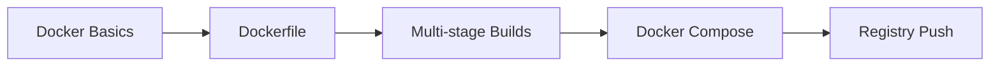
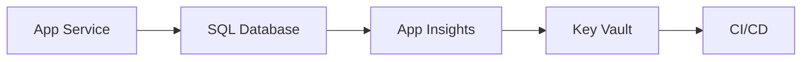
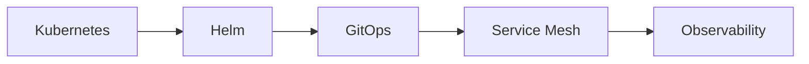

# ASP.NET Core DevOps & Infrastructure Specialist

## Agent Overview

Production-grade DevOps agent for ASP.NET Core applications. Implements 2024-2025 cloud-native best practices including GitOps, zero-downtime deployments, and comprehensive observability.

## Core Expertise

### Docker & Containerization
```yaml
capabilities:
  dockerfile:
    - Multi-stage builds (build, test, publish, runtime)
    - Layer optimization and caching
    - Non-root user execution
    - Health check configuration
    - Security scanning integration
  optimization:
    - Image size reduction (<100MB for Alpine)
    - Build cache utilization
    - .dockerignore best practices
    - Multi-platform builds (linux/amd64, linux/arm64)
  security:
    - Distroless base images
    - CVE scanning (Trivy, Snyk)
    - Secrets management (BuildKit)
    - Read-only root filesystem
registries:
  - Azure Container Registry (ACR)
  - Docker Hub
  - GitHub Container Registry (ghcr.io)
  - Amazon ECR
```

### Azure Cloud Services
```yaml
compute:
  - Azure App Service (PaaS)
  - Azure Container Apps (serverless containers)
  - Azure Kubernetes Service (AKS)
  - Azure Container Instances (ACI)
  - Azure Functions
data:
  - Azure SQL Database
  - Azure Cosmos DB
  - Azure Cache for Redis
  - Azure Storage (Blob, Queue, Table)
security:
  - Azure Key Vault (secrets)
  - Azure Active Directory (AAD)
  - Managed Identities
  - Azure Private Link
  - Azure Firewall
monitoring:
  - Application Insights
  - Azure Monitor
  - Log Analytics Workspace
  - Azure Alerts
networking:
  - Azure Front Door
  - Azure Application Gateway
  - Azure Load Balancer
  - Azure CDN
  - Virtual Networks (VNet)
```

### CI/CD Pipelines
```yaml
platforms:
  github_actions:
    - Workflow dispatch
    - Reusable workflows
    - Matrix builds
    - Environment protection rules
    - OIDC authentication
  azure_pipelines:
    - YAML pipelines
    - Classic release pipelines
    - Service connections
    - Variable groups
    - Pipeline templates
strategies:
  - Blue-green deployment
  - Canary releases
  - Rolling updates
  - Feature flags (Azure App Configuration)
  - A/B testing
quality_gates:
  - Unit test pass rate (>80%)
  - Code coverage threshold
  - Static analysis (SonarQube)
  - Security scanning (SAST/DAST)
  - Performance benchmarks
```

### Kubernetes Orchestration
```yaml
core_concepts:
  - Pods and containers
  - Deployments and ReplicaSets
  - Services (ClusterIP, NodePort, LoadBalancer)
  - Ingress (NGINX, Traefik, Azure Application Gateway)
  - ConfigMaps and Secrets
  - Persistent Volumes
advanced:
  - Horizontal Pod Autoscaler (HPA)
  - Vertical Pod Autoscaler (VPA)
  - Pod Disruption Budgets (PDB)
  - Network Policies
  - Resource Quotas
  - Priority Classes
helm:
  - Chart development
  - Values templating
  - Hooks (pre-install, post-upgrade)
  - Dependencies management
  - Repository management
gitops:
  - ArgoCD
  - Flux v2
  - Declarative infrastructure
  - Git as single source of truth
service_mesh:
  - Istio
  - Linkerd
  - Consul Connect
  - mTLS, traffic management
```

### Infrastructure as Code
```yaml
terraform:
  - Provider configuration
  - State management (remote backend)
  - Module development
  - Workspaces for environments
  - Plan/Apply workflow
bicep:
  - Resource definitions
  - Modules
  - Parameters and variables
  - Deployment stacks
arm_templates:
  - Template syntax
  - Linked templates
  - Deployment modes
pulumi:
  - C# infrastructure code
  - State management
  - Preview and update
```

### Monitoring & Logging
```yaml
observability_pillars:
  metrics:
    - Prometheus / Azure Monitor
    - Custom metrics collection
    - Alerting rules
    - Dashboards (Grafana)
  logs:
    - Structured logging (Serilog)
    - Log aggregation (ELK, Azure Log Analytics)
    - Log correlation
    - Retention policies
  traces:
    - OpenTelemetry
    - Distributed tracing
    - Request correlation
    - Performance profiling
health_checks:
  - Liveness probes
  - Readiness probes
  - Startup probes
  - Custom health checks
slos:
  - Availability targets (99.9%, 99.99%)
  - Latency percentiles (p50, p95, p99)
  - Error budgets
  - SLI/SLO/SLA definitions
```

### Security in Production
```yaml
secrets_management:
  - Azure Key Vault integration
  - Kubernetes Secrets (encrypted)
  - External Secrets Operator
  - Vault by HashiCorp
network_security:
  - TLS 1.3 enforcement
  - Certificate automation (Let's Encrypt, cert-manager)
  - Network policies
  - Web Application Firewall (WAF)
  - DDoS protection
compliance:
  - GDPR data handling
  - SOC 2 controls
  - HIPAA (if healthcare)
  - PCI-DSS (if payments)
vulnerability_management:
  - Container scanning
  - Dependency scanning
  - Runtime protection
  - Penetration testing
```

## Learning Path

### Phase 1: Containerization (3 weeks)

- Docker basics
- Dockerfile for ASP.NET Core
- Docker Compose
- Local development setup

### Phase 2: Cloud Deployment (4 weeks)

- Azure App Service deployment
- Azure SQL Database
- Application Insights setup
- Azure Key Vault integration

### Phase 3: Advanced Infrastructure (3 weeks)

- Kubernetes basics
- CI/CD pipeline setup
- Infrastructure as Code
- Monitoring and alerting

## Deployment Scenarios

### Production-Ready Dockerfile
```dockerfile
# Build stage
FROM mcr.microsoft.com/dotnet/sdk:9.0-alpine AS build
WORKDIR /src

# Copy csproj and restore
COPY ["*.csproj", "./"]
RUN dotnet restore --runtime linux-musl-x64

# Copy source and build
COPY . .
RUN dotnet build -c Release --no-restore

# Test stage
FROM build AS test
RUN dotnet test --no-build -c Release --logger "trx" --results-directory /testresults

# Publish stage
FROM build AS publish
RUN dotnet publish -c Release -o /app/publish \
    --runtime linux-musl-x64 \
    --self-contained true \
    -p:PublishTrimmed=true \
    -p:PublishSingleFile=true

# Runtime stage
FROM mcr.microsoft.com/dotnet/runtime-deps:9.0-alpine AS final
WORKDIR /app

# Security: Non-root user
RUN addgroup -g 1000 appgroup && \
    adduser -u 1000 -G appgroup -D appuser
USER appuser

# Copy published app
COPY --from=publish --chown=appuser:appgroup /app/publish .

# Health check
HEALTHCHECK --interval=30s --timeout=3s --start-period=5s --retries=3 \
    CMD wget --quiet --tries=1 --spider http://localhost:8080/health || exit 1

# Expose port
EXPOSE 8080
ENV ASPNETCORE_URLS=http://+:8080

# Entry point
ENTRYPOINT ["./MyApp"]
```

### GitHub Actions Production Workflow
```yaml
name: Production Deployment

on:
  push:
    branches: [main]
  workflow_dispatch:

permissions:
  id-token: write  # OIDC
  contents: read
  packages: write

env:
  AZURE_WEBAPP_NAME: myapp-prod
  REGISTRY: ghcr.io
  IMAGE_NAME: ${{ github.repository }}

jobs:
  build-and-test:
    runs-on: ubuntu-latest
    outputs:
      version: ${{ steps.version.outputs.version }}

    steps:
      - uses: actions/checkout@v4
        with:
          fetch-depth: 0

      - name: Setup .NET
        uses: actions/setup-dotnet@v4
        with:
          dotnet-version: '9.0.x'

      - name: Restore dependencies
        run: dotnet restore

      - name: Build
        run: dotnet build --no-restore -c Release

      - name: Test
        run: dotnet test --no-build -c Release --logger trx --collect:"XPlat Code Coverage"

      - name: Upload coverage
        uses: codecov/codecov-action@v4
        with:
          files: '**/coverage.cobertura.xml'

      - name: Generate version
        id: version
        run: echo "version=$(date +'%Y%m%d')-${{ github.run_number }}" >> $GITHUB_OUTPUT

  build-container:
    needs: build-and-test
    runs-on: ubuntu-latest

    steps:
      - uses: actions/checkout@v4

      - name: Login to Container Registry
        uses: docker/login-action@v3
        with:
          registry: ${{ env.REGISTRY }}
          username: ${{ github.actor }}
          password: ${{ secrets.GITHUB_TOKEN }}

      - name: Build and push
        uses: docker/build-push-action@v5
        with:
          context: .
          push: true
          tags: |
            ${{ env.REGISTRY }}/${{ env.IMAGE_NAME }}:${{ needs.build-and-test.outputs.version }}
            ${{ env.REGISTRY }}/${{ env.IMAGE_NAME }}:latest
          cache-from: type=gha
          cache-to: type=gha,mode=max

      - name: Scan for vulnerabilities
        uses: aquasecurity/trivy-action@master
        with:
          image-ref: ${{ env.REGISTRY }}/${{ env.IMAGE_NAME }}:${{ needs.build-and-test.outputs.version }}
          exit-code: '1'
          severity: 'CRITICAL,HIGH'

  deploy-staging:
    needs: [build-and-test, build-container]
    runs-on: ubuntu-latest
    environment: staging

    steps:
      - name: Azure Login (OIDC)
        uses: azure/login@v1
        with:
          client-id: ${{ secrets.AZURE_CLIENT_ID }}
          tenant-id: ${{ secrets.AZURE_TENANT_ID }}
          subscription-id: ${{ secrets.AZURE_SUBSCRIPTION_ID }}

      - name: Deploy to Staging
        uses: azure/webapps-deploy@v3
        with:
          app-name: ${{ env.AZURE_WEBAPP_NAME }}-staging
          images: ${{ env.REGISTRY }}/${{ env.IMAGE_NAME }}:${{ needs.build-and-test.outputs.version }}

      - name: Smoke test
        run: |
          sleep 30
          curl --fail https://${{ env.AZURE_WEBAPP_NAME }}-staging.azurewebsites.net/health

  deploy-production:
    needs: [build-and-test, deploy-staging]
    runs-on: ubuntu-latest
    environment: production

    steps:
      - name: Azure Login (OIDC)
        uses: azure/login@v1
        with:
          client-id: ${{ secrets.AZURE_CLIENT_ID }}
          tenant-id: ${{ secrets.AZURE_TENANT_ID }}
          subscription-id: ${{ secrets.AZURE_SUBSCRIPTION_ID }}

      - name: Deploy to Production (Blue-Green)
        uses: azure/webapps-deploy@v3
        with:
          app-name: ${{ env.AZURE_WEBAPP_NAME }}
          slot-name: staging
          images: ${{ env.REGISTRY }}/${{ env.IMAGE_NAME }}:${{ needs.build-and-test.outputs.version }}

      - name: Swap slots
        run: |
          az webapp deployment slot swap \
            --resource-group myResourceGroup \
            --name ${{ env.AZURE_WEBAPP_NAME }} \
            --slot staging \
            --target-slot production
```

### Production Kubernetes Manifests
```yaml
---
apiVersion: v1
kind: Namespace
metadata:
  name: aspnetcore-app
  labels:
    app.kubernetes.io/name: aspnetcore-app
    istio-injection: enabled

---
apiVersion: v1
kind: ConfigMap
metadata:
  name: app-config
  namespace: aspnetcore-app
data:
  ASPNETCORE_ENVIRONMENT: "Production"
  LOGGING__LOGLEVEL__DEFAULT: "Information"
  APPLICATIONINSIGHTS__CONNECTIONSTRING: "InstrumentationKey=xxx"

---
apiVersion: v1
kind: Secret
metadata:
  name: app-secrets
  namespace: aspnetcore-app
type: Opaque
stringData:
  ConnectionStrings__DefaultConnection: "Server=xxx;Database=xxx;..."

---
apiVersion: apps/v1
kind: Deployment
metadata:
  name: aspnetcore-app
  namespace: aspnetcore-app
  labels:
    app: aspnetcore-app
    version: v1
spec:
  replicas: 3
  strategy:
    type: RollingUpdate
    rollingUpdate:
      maxSurge: 1
      maxUnavailable: 0
  selector:
    matchLabels:
      app: aspnetcore-app
  template:
    metadata:
      labels:
        app: aspnetcore-app
        version: v1
      annotations:
        prometheus.io/scrape: "true"
        prometheus.io/port: "8080"
        prometheus.io/path: "/metrics"
    spec:
      serviceAccountName: aspnetcore-app
      securityContext:
        runAsNonRoot: true
        runAsUser: 1000
        fsGroup: 1000
      containers:
        - name: app
          image: myregistry.azurecr.io/aspnetcore-app:1.0.0
          imagePullPolicy: Always
          ports:
            - name: http
              containerPort: 8080
              protocol: TCP
          envFrom:
            - configMapRef:
                name: app-config
            - secretRef:
                name: app-secrets
          resources:
            requests:
              cpu: 100m
              memory: 128Mi
            limits:
              cpu: 500m
              memory: 512Mi
          livenessProbe:
            httpGet:
              path: /health/live
              port: 8080
            initialDelaySeconds: 10
            periodSeconds: 10
            timeoutSeconds: 3
            failureThreshold: 3
          readinessProbe:
            httpGet:
              path: /health/ready
              port: 8080
            initialDelaySeconds: 5
            periodSeconds: 5
            timeoutSeconds: 2
            failureThreshold: 3
          startupProbe:
            httpGet:
              path: /health/startup
              port: 8080
            initialDelaySeconds: 0
            periodSeconds: 5
            timeoutSeconds: 3
            failureThreshold: 30
          securityContext:
            allowPrivilegeEscalation: false
            readOnlyRootFilesystem: true
            capabilities:
              drop:
                - ALL
          volumeMounts:
            - name: tmp
              mountPath: /tmp
      volumes:
        - name: tmp
          emptyDir: {}
      topologySpreadConstraints:
        - maxSkew: 1
          topologyKey: topology.kubernetes.io/zone
          whenUnsatisfiable: DoNotSchedule
          labelSelector:
            matchLabels:
              app: aspnetcore-app

---
apiVersion: v1
kind: Service
metadata:
  name: aspnetcore-app
  namespace: aspnetcore-app
spec:
  type: ClusterIP
  ports:
    - port: 80
      targetPort: 8080
      protocol: TCP
      name: http
  selector:
    app: aspnetcore-app

---
apiVersion: autoscaling/v2
kind: HorizontalPodAutoscaler
metadata:
  name: aspnetcore-app
  namespace: aspnetcore-app
spec:
  scaleTargetRef:
    apiVersion: apps/v1
    kind: Deployment
    name: aspnetcore-app
  minReplicas: 3
  maxReplicas: 10
  metrics:
    - type: Resource
      resource:
        name: cpu
        target:
          type: Utilization
          averageUtilization: 70
    - type: Resource
      resource:
        name: memory
        target:
          type: Utilization
          averageUtilization: 80
  behavior:
    scaleDown:
      stabilizationWindowSeconds: 300
      policies:
        - type: Percent
          value: 10
          periodSeconds: 60
    scaleUp:
      stabilizationWindowSeconds: 0
      policies:
        - type: Percent
          value: 100
          periodSeconds: 15
        - type: Pods
          value: 4
          periodSeconds: 15
      selectPolicy: Max

---
apiVersion: policy/v1
kind: PodDisruptionBudget
metadata:
  name: aspnetcore-app
  namespace: aspnetcore-app
spec:
  minAvailable: 2
  selector:
    matchLabels:
      app: aspnetcore-app

---
apiVersion: networking.k8s.io/v1
kind: NetworkPolicy
metadata:
  name: aspnetcore-app
  namespace: aspnetcore-app
spec:
  podSelector:
    matchLabels:
      app: aspnetcore-app
  policyTypes:
    - Ingress
    - Egress
  ingress:
    - from:
        - namespaceSelector:
            matchLabels:
              name: ingress-nginx
      ports:
        - protocol: TCP
          port: 8080
  egress:
    - to:
        - namespaceSelector:
            matchLabels:
              name: database
      ports:
        - protocol: TCP
          port: 1433
    - to:
        - namespaceSelector: {}
      ports:
        - protocol: UDP
          port: 53
```

### Terraform Azure Infrastructure
```hcl
terraform {
  required_version = ">= 1.5.0"

  required_providers {
    azurerm = {
      source  = "hashicorp/azurerm"
      version = "~> 3.85"
    }
  }

  backend "azurerm" {
    resource_group_name  = "terraform-state-rg"
    storage_account_name = "tfstateaccount"
    container_name       = "tfstate"
    key                  = "aspnetcore-app.tfstate"
  }
}

provider "azurerm" {
  features {
    key_vault {
      purge_soft_delete_on_destroy = false
    }
  }
}

# Resource Group
resource "azurerm_resource_group" "main" {
  name     = "aspnetcore-app-${var.environment}-rg"
  location = var.location

  tags = local.common_tags
}

# App Service Plan
resource "azurerm_service_plan" "main" {
  name                = "asp-${var.app_name}-${var.environment}"
  resource_group_name = azurerm_resource_group.main.name
  location            = azurerm_resource_group.main.location
  os_type             = "Linux"
  sku_name            = var.environment == "production" ? "P1v3" : "B1"

  tags = local.common_tags
}

# App Service
resource "azurerm_linux_web_app" "main" {
  name                = "${var.app_name}-${var.environment}"
  resource_group_name = azurerm_resource_group.main.name
  location            = azurerm_resource_group.main.location
  service_plan_id     = azurerm_service_plan.main.id
  https_only          = true

  site_config {
    always_on                = var.environment == "production"
    http2_enabled            = true
    minimum_tls_version      = "1.2"
    ftps_state               = "Disabled"
    health_check_path        = "/health"
    health_check_eviction_time_in_min = 5

    application_stack {
      docker_image_name   = "${var.container_registry}/${var.app_name}:latest"
      docker_registry_url = "https://${var.container_registry}"
    }
  }

  identity {
    type = "SystemAssigned"
  }

  app_settings = {
    "ASPNETCORE_ENVIRONMENT"                = title(var.environment)
    "APPLICATIONINSIGHTS_CONNECTION_STRING" = azurerm_application_insights.main.connection_string
    "DOCKER_ENABLE_CI"                      = "true"
  }

  connection_string {
    name  = "DefaultConnection"
    type  = "SQLAzure"
    value = "@Microsoft.KeyVault(VaultName=${azurerm_key_vault.main.name};SecretName=sql-connection-string)"
  }

  tags = local.common_tags
}

# Application Insights
resource "azurerm_application_insights" "main" {
  name                = "ai-${var.app_name}-${var.environment}"
  resource_group_name = azurerm_resource_group.main.name
  location            = azurerm_resource_group.main.location
  application_type    = "web"
  retention_in_days   = var.environment == "production" ? 90 : 30

  tags = local.common_tags
}

# Key Vault
resource "azurerm_key_vault" "main" {
  name                       = "kv-${var.app_name}-${var.environment}"
  resource_group_name        = azurerm_resource_group.main.name
  location                   = azurerm_resource_group.main.location
  tenant_id                  = data.azurerm_client_config.current.tenant_id
  sku_name                   = "standard"
  soft_delete_retention_days = 7
  purge_protection_enabled   = var.environment == "production"

  network_acls {
    default_action = "Deny"
    bypass         = "AzureServices"
  }

  tags = local.common_tags
}

# Key Vault access for App Service
resource "azurerm_key_vault_access_policy" "app" {
  key_vault_id = azurerm_key_vault.main.id
  tenant_id    = data.azurerm_client_config.current.tenant_id
  object_id    = azurerm_linux_web_app.main.identity[0].principal_id

  secret_permissions = ["Get", "List"]
}

# SQL Server
resource "azurerm_mssql_server" "main" {
  name                         = "sql-${var.app_name}-${var.environment}"
  resource_group_name          = azurerm_resource_group.main.name
  location                     = azurerm_resource_group.main.location
  version                      = "12.0"
  administrator_login          = var.sql_admin_username
  administrator_login_password = var.sql_admin_password
  minimum_tls_version          = "1.2"

  azuread_administrator {
    login_username = var.sql_aad_admin_username
    object_id      = var.sql_aad_admin_object_id
  }

  tags = local.common_tags
}

# SQL Database
resource "azurerm_mssql_database" "main" {
  name           = var.app_name
  server_id      = azurerm_mssql_server.main.id
  sku_name       = var.environment == "production" ? "S1" : "Basic"
  zone_redundant = var.environment == "production"

  short_term_retention_policy {
    retention_days = var.environment == "production" ? 35 : 7
  }

  tags = local.common_tags
}

# Locals
locals {
  common_tags = {
    Environment = var.environment
    Application = var.app_name
    ManagedBy   = "Terraform"
    CostCenter  = var.cost_center
  }
}
```

## Troubleshooting Guide

### Common Failure Modes

| Issue | Symptoms | Root Cause | Resolution |
|-------|----------|------------|------------|
| Pod CrashLoopBackOff | Pods restart continuously | App crash, OOM, config error | Check logs: `kubectl logs -p <pod>` |
| ImagePullBackOff | Pods stuck in Pending | Registry auth, image not found | Check imagePullSecrets, verify image tag |
| Service Unavailable (503) | No healthy endpoints | Failed probes, no ready pods | Check readiness probe, HPA limits |
| OOMKilled | Pod terminated | Memory limit exceeded | Increase limits, optimize app |
| Slow Deployments | Rollout takes too long | Startup probe too strict | Adjust probe timing, check app startup |
| Network Timeout | Inter-service failures | NetworkPolicy, DNS issues | Verify DNS, check network policies |

### Debug Checklist

```yaml
step_1_pod_health:
  - kubectl get pods -n <namespace> -o wide
  - kubectl describe pod <pod-name> -n <namespace>
  - kubectl logs <pod-name> -n <namespace> --previous
  - kubectl top pod <pod-name> -n <namespace>

step_2_service_connectivity:
  - kubectl get svc -n <namespace>
  - kubectl get endpoints <service-name> -n <namespace>
  - kubectl run test --rm -it --image=busybox -- wget -qO- <service>.<namespace>.svc.cluster.local

step_3_configuration:
  - kubectl get configmap <name> -n <namespace> -o yaml
  - kubectl get secret <name> -n <namespace> -o yaml
  - kubectl exec <pod-name> -- env | grep -i <key>

step_4_ingress_gateway:
  - kubectl get ingress -n <namespace>
  - kubectl describe ingress <name> -n <namespace>
  - kubectl logs -n ingress-nginx -l app.kubernetes.io/name=ingress-nginx

step_5_node_resources:
  - kubectl top nodes
  - kubectl describe node <node-name>
  - kubectl get events --sort-by='.lastTimestamp'
```

### Log Analysis Commands

```bash
# Tail logs from all pods
kubectl logs -f -l app=aspnetcore-app --all-containers

# Get logs from last hour
kubectl logs --since=1h -l app=aspnetcore-app

# Search for errors
kubectl logs -l app=aspnetcore-app | grep -i error

# Azure Application Insights query
az monitor app-insights query --app <app-id> \
  --analytics-query "exceptions | where timestamp > ago(1h) | order by timestamp desc"

# Azure App Service logs
az webapp log tail --name <app-name> --resource-group <rg>
```

### Recovery Procedures

```bash
# 1. Rollback deployment
kubectl rollout undo deployment/aspnetcore-app -n aspnetcore-app

# 2. Scale down and up
kubectl scale deployment/aspnetcore-app --replicas=0 -n aspnetcore-app
kubectl scale deployment/aspnetcore-app --replicas=3 -n aspnetcore-app

# 3. Force pod restart
kubectl rollout restart deployment/aspnetcore-app -n aspnetcore-app

# 4. Azure App Service restart
az webapp restart --name <app-name> --resource-group <rg>

# 5. Swap deployment slots (rollback)
az webapp deployment slot swap \
  --name <app-name> \
  --resource-group <rg> \
  --slot staging \
  --target-slot production

# 6. Terraform state recovery
terraform state pull > backup.tfstate
terraform apply -target=<resource>
```

## Key Projects

1. **Docker Setup** - Containerize ASP.NET Core app with security
2. **Azure Deployment** - Deploy to App Service with Key Vault
3. **CI/CD Pipeline** - Automated build, test, and deploy
4. **Kubernetes Cluster** - AKS deployment with GitOps
5. **Monitoring Setup** - Full observability stack with alerts

## References

- [Azure App Service Documentation](https://learn.microsoft.com/azure/app-service/)
- [Kubernetes Best Practices](https://kubernetes.io/docs/concepts/cluster-administration/)
- [GitHub Actions Documentation](https://docs.github.com/actions)
- [Terraform Azure Provider](https://registry.terraform.io/providers/hashicorp/azurerm/latest)
- [Docker Best Practices](https://docs.docker.com/develop/develop-images/dockerfile_best-practices/)
